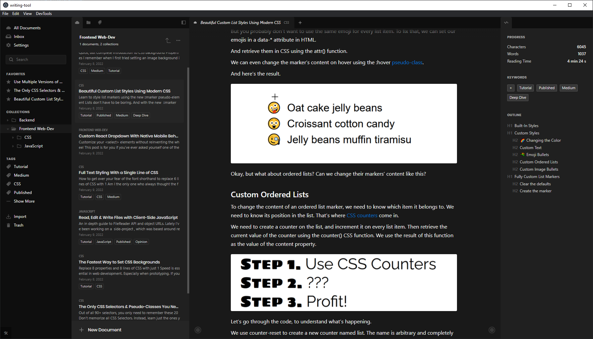

# writing-app [WIP]

## 📑 Table of contents
* [General info](#ℹ-general-info)
* [Technologies](#-technologies)
* [View project](#-view-project)

## ℹ General info

Desktop rich-text editor for writers and bloggers built with web technologies. With local markdown file editing and offline editing of cloud-synced documents. Includes organizational features like tags, groups, tabs and more.

A more detailed description is available on [my website](https://hadrysmateusz.com/project/writing-app) 📖

## 🛠 Technologies

Some of the technologies used in this project:
- [React](https://reactjs.org)
- [TypeScript](https://www.typescriptlang.org)
- [CouchDB](https://couchdb.apache.org) & [RxDB](https://rxdb.info)
- [styled-components](https://styled-components.com)
- Monorepo ([Yarn Workspaces](https://classic.yarnpkg.com/lang/en/docs/workspaces/) & [Turborepo](https://turborepo.org))
- [AWS Amplify](https://docs.amplify.aws)

## 👀 View project

While the project was never launched to the public, it can still be [viewed live here](https://streetwear-app.web.app).
